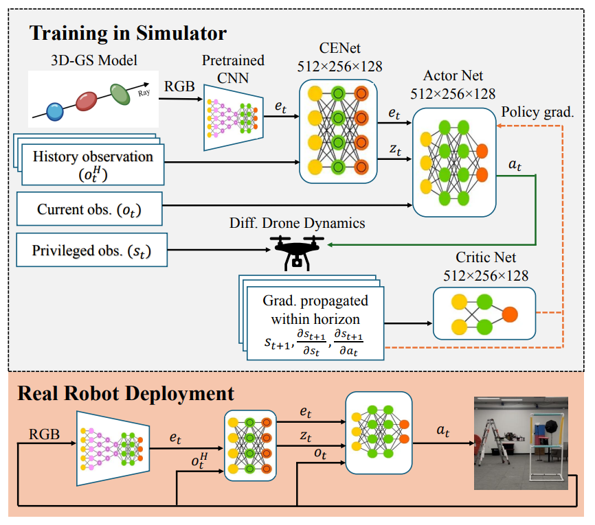

<div align="center">


# GRaD-Nav: Learning Visual Drone Navigation with Gaussian Radiance Fields and Differentiable Dynamics


[Project Page](https://qianzhong-chen.github.io/gradnav.github.io/) | [Video](https://www.youtube.com/watch?v=ySCSm8eJLyY&t=3s) | [Arxiv](https://arxiv.org/abs/2503.03984)

</div>

<div align="center">
  
</div>

---

## Configurations

- Clone the repository:
  ```
  git clone https://github.com/Qianzhong-Chen/grad_nav.git
  ```


#### Set up conda environment and install dependencies.

- Install and configure [nerfstudio](https://github.com/nerfstudio-project/nerfstudio), start nerfstudio conda env

  ```
  conda activate nerfstudio
  pip install gsplat
  ```

- Install gym
  ```
  pip install gym
  ```

## Data Download and Setup

- Download the required [data](https://drive.google.com/drive/folders/1XEoJU3PVTMx782MMfSFNm5D0zTawKrbJ?usp=sharing).
   ```
   cd grad_nav/envs/assets
   gdown --id 1xIDb1-HFkniBagvMbWDgfy4okKTckwra # point cloud data
   unzip point_cloud.zip
   gdown --id 1skbXqg__Ew3ytNmqe_xiaqHpexZnsfdw # 3DGS data
   unzip gs_data.zip
   cd ../../
   ```


## Training

### 1. GRaD-Nav:
- GRaD-Nav long trajectory training:
  ```
  python examples/train_gradnav.py --cfg examples/cfg/gradnav/drone_long_traj.yaml --logdir examples/logs/DroneLongTraj/gradnav
  ```
- GRaD-Nav multi-gate training:
  ```
  python examples/train_gradnav.py --cfg examples/cfg/gradnav/drone_multi_gate.yaml --logdir examples/logs/DroneMultiGate/gradnav
  ```
### 2. Baselines
- PPO long trajectory training:
  ```
  python examples/train_ppo.py --cfg examples/cfg/ppo/drone_ppo.yaml --logdir examples/logs/DronePPO/ppo
  ```
- BPTT long trajectory training:
  ```
  python examples/train_bptt.py --cfg examples/cfg/bptt/drone_long_traj.yaml --logdir examples/logs/DroneLongTraj/bptt
  ```
- Using [wandb](https://docs.wandb.ai/quickstart/)  
  remove `os.environ["WANDB_MODE"] = "disabled"` from `algorithms/<algorithm_name>.py`


## Testing
### 1. GRaD-Nav:
- GRaD-Nav long trajectory training:
  ```
  python examples/train_gradnav.py --cfg examples/cfg/gradnav/drone_long_traj.yaml --checkpoint examples/logs/DroneLongTraj/gradnav/<map_name>/<time_stamp>/best_policy.pt --play --render
  ```
- GRaD-Nav multi-gate training:
  ```
  python examples/train_gradnav.py --cfg examples/cfg/gradnav/drone_multi_gate.yaml --checkpoint examples/logs/DroneMultiGate/gradnav/<map_name>/<time_stamp>/best_policy.pt --play --render
  ```
### 2. Baselines
- PPO long trajectory training:
  ```
  python examples/train_ppo.py --cfg examples/cfg/ppo/drone_ppo.yaml --checkpoint examples/logs/DronePPO/ppo/<map_name>/<time_stamp>/best_policy.pt --play --render
  ```
- BPTT long trajectory training:
  ```
  python examples/train_bptt.py --cfg examples/cfg/bptt/drone_long_traj.yaml --checkpoint examples/logs/DroneLongTraj/bptt/<map_name>/<time_stamp>/best_policy.pt --play --render
  ```
### 3. Test results
- Simulation results can be found at `examples/outputs/<env_name>/<map_name>/<time_stamp>/`

## Citation

If you find our paper or code is useful, please consider citing:
```kvk
  @misc{chen2025gradnavefficientlylearningvisual,
        title={GRaD-Nav: Efficiently Learning Visual Drone Navigation with Gaussian Radiance Fields and Differentiable Dynamics}, 
        author={Qianzhong Chen and Jiankai Sun and Naixiang Gao and JunEn Low and Timothy Chen and Mac Schwager},
        year={2025},
        eprint={2503.03984},
        archivePrefix={arXiv},
        primaryClass={cs.RO},
        url={https://arxiv.org/abs/2503.03984}, 
    }
```